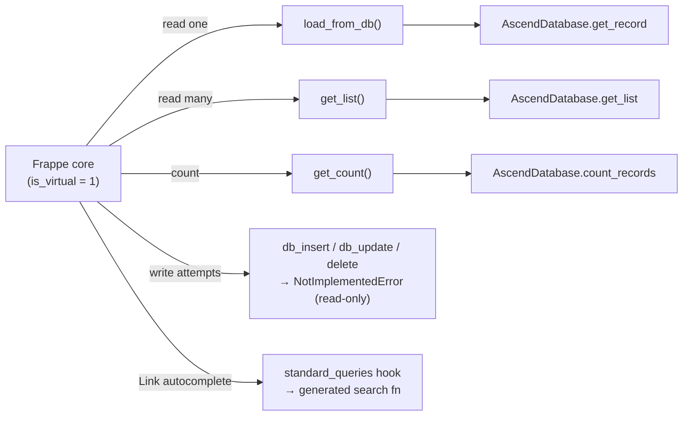
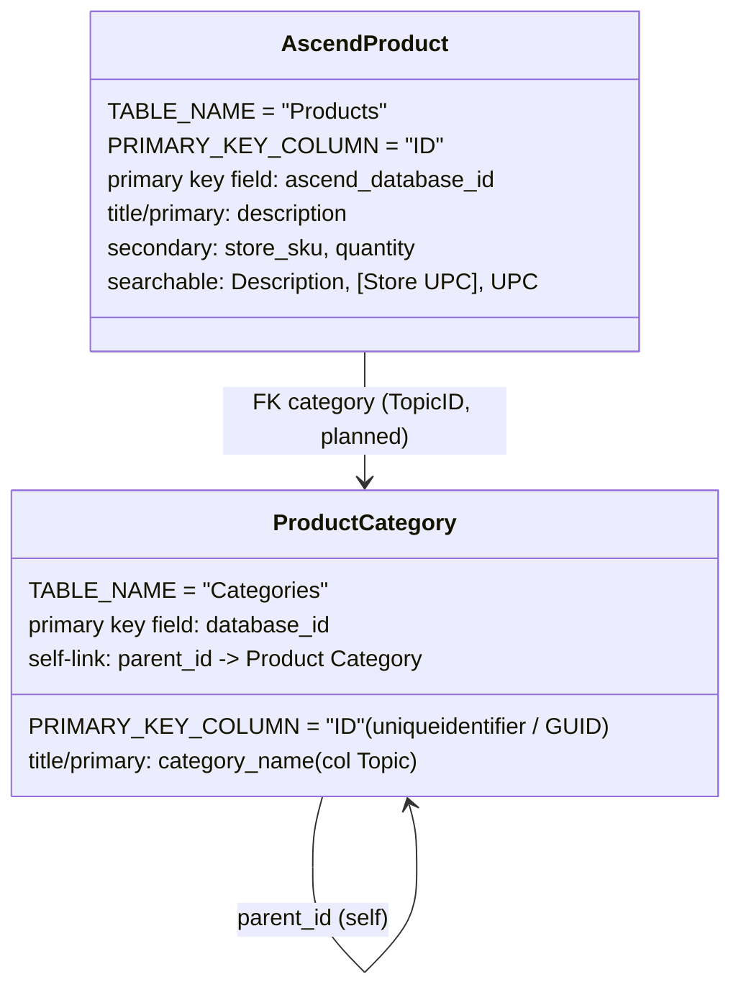
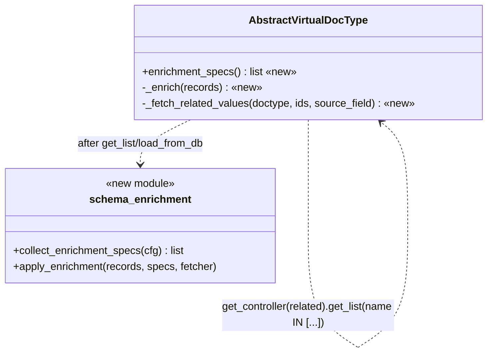

# Ascend Virtual DocType Framework — Architecture Reference

A class diagram, data-flow infographic, and structural detail for the Bullwheel
Ascend virtual DocType framework. The Mermaid blocks render in GitHub, VS Code
(with a Mermaid extension), and any Mermaid-compatible tool; the ASCII diagrams
render anywhere. Hand this file to a diagramming tool, or read it as-is.

> Scope: documents the **implemented** framework. A clearly-marked "Planned
> Extension" section at the end covers the single-hop related-field enrichment
> that has been designed but not yet built.

---

## 1. Class Diagram

```mermaid
classDiagram
    direction TB

    class Document {
        <<Frappe base class>>
        +str name
        +str doctype
        +load_from_db()
        +db_insert()
        +db_update()
        +delete()
    }

    class AbstractVirtualDocType {
        <<abstract>>
        +str TABLE_NAME$
        +str PRIMARY_KEY_COLUMN$
        +dict SCHEMA_CONFIG$
        +field_to_column() dict
        +select_clause() str
        +search_columns() list
        +primary_key_field() str
        +get_list(filters, page_length, start, txt, or_filters, **kw) list
        +get_count(filters, txt, or_filters) int
        +get_stats()
        +load_from_db()
        +make_search_function(display_fields) callable
        +db_insert() NotImplementedError
        +db_update() NotImplementedError
        +delete() NotImplementedError
        -_derived(attr, builder)
        -_to_document_dict(record) _dict
        -_resolve_order_by(order_by) tuple
    }

    class AscendProduct {
        +TABLE_NAME = "Products"
        +PRIMARY_KEY_COLUMN = "ID"
        +SCHEMA_CONFIG = {19 fields}
    }

    class ProductCategory {
        +TABLE_NAME = "Categories"
        +PRIMARY_KEY_COLUMN = "ID"
        +SCHEMA_CONFIG = {22 fields}
    }

    class AscendDatabase {
        <<query layer / context manager>>
        -SQL_Server _server_document
        -MSSQLDatabase _database
        +get_record(table, select, id_col, id) dict
        +get_list(table, select, id_col, f2c, filters, search, page, start, txt, or_filters, order_by, order) list
        +count_records(table, f2c, filters, search, txt, or_filters) int
        +record_exists(table, id_col, id) bool
        -_build_where_clause(f2c, filters, search, txt, or_filters)$ tuple
        -_extract_search_text(txt, or_filters)$ str
    }

    class MSSQLDatabase {
        <<connection / execution layer>>
        +connect()
        +sql(query, values, as_dict, ...) list
        +commit()
        +rollback()
        +test_connection() bool
    }

    class schema_config_builder {
        <<module — pure functions>>
        +normalize_record(record) dict
        +build_field_to_column(cfg, pk) dict
        +build_select_clause(cfg) str
        +build_search_columns(cfg) list
        +find_primary_key_field(cfg, pk) str
        +build_json_schema(cfg) list
        +validate_schema_config(cfg, pk, cols) bool
    }

    class search_hook_helper {
        <<module>>
        +create_virtual_doctype_search(...) callable
    }

    class schema_introspection {
        <<module>>
        +introspect_table_schema(server, table) dict
        +suggest_schema_config(schema) dict
        +format_schema_table(schema) str
    }

    class hooks_standard_queries {
        <<hooks.py>>
        Ascend Product -> ascend_product_search
        Product Category -> product_category_search
    }

    Document <|-- AbstractVirtualDocType
    AbstractVirtualDocType <|-- AscendProduct
    AbstractVirtualDocType <|-- ProductCategory

    AbstractVirtualDocType ..> schema_config_builder : derives constants via
    AbstractVirtualDocType ..> AscendDatabase : queries through
    AbstractVirtualDocType ..> search_hook_helper : make_search_function()
    AscendDatabase o-- MSSQLDatabase : wraps (composition)
    AscendDatabase ..> schema_config_builder : _build_where_clause uses f2c
    search_hook_helper ..> AscendDatabase : queries through
    schema_introspection ..> MSSQLDatabase : INFORMATION_SCHEMA
    hooks_standard_queries ..> search_hook_helper : registers generated fn
    schema_config_builder ..> schema_introspection : validate against discovered cols
```

`$` = static/class-level member. `<<...>>` = stereotype. Dashed arrow `..>` =
"uses / depends on"; hollow-diamond `o--` = composition; hollow-triangle `<|--`
= inheritance.

---

## 2. Data-Flow Infographic

### 2a. Single source of truth — `SCHEMA_CONFIG` fan-out

```
                       ┌──────────────────────────────┐
                       │        SCHEMA_CONFIG          │
                       │  (one dict on the controller) │
                       │  fieldname -> {               │
                       │     sql_column, fieldtype,    │
                       │     display, searchable }     │
                       └───────────────┬──────────────┘
                                       │  schema_config_builder
        ┌───────────────┬──────────────┼───────────────┬────────────────┐
        ▼               ▼              ▼               ▼                ▼
 build_field_to_  build_select_  build_search_  find_primary_    build_json_
   column()         clause()       columns()      key_field()      schema()
        │               │              │               │                │
        ▼               ▼              ▼               ▼                ▼
 FIELD_TO_COLUMN   SELECT_CLAUSE  SEARCH_COLUMNS  primary key      doctype.json
 (filter/order →   (col AS field) (OR LIKE cols)  fieldname →      `fields[]`
  SQL column)                                     `name` meta      scaffold
```

All four runtime constants (and the JSON scaffold) come from the **one** dict —
they cannot drift apart. Derived values are computed lazily and cached per
subclass via `_derived()`.

### 2b. Request → SQL layering

```
   Frappe Desk                Controller                 Query layers            SQL Server
 ┌───────────────┐   ┌─────────────────────────┐   ┌──────────────────┐   ┌──────────────┐
 │ List view     │──▶│ AscendProduct.get_list  │──▶│ AscendDatabase   │──▶│ MSSQL  .sql  │──▶ Products
 │ (sort/filter) │   │   _resolve_order_by      │   │  .get_list       │   │ (pymssql)    │   table
 ├───────────────┤   │   _to_document_dict      │   │  _build_where_   │   │              │
 │ Form (open    │──▶│ AscendProduct.load_      │──▶│   clause         │──▶│ OFFSET/FETCH │──▶ row
 │ one record)   │   │   from_db                │   │  .get_record     │   │ paginated    │
 ├───────────────┤   ├─────────────────────────┤   │  .count_records  │   │ parameterized│
 │ Link auto-    │──▶│ ascend_product_search   │──▶│                  │   │ queries      │
 │ complete      │   │ (standard_queries hook)  │   │                  │   │              │
 └───────────────┘   └─────────────────────────┘   └──────────────────┘   └──────────────┘
         ▲                       │                          │
         │   normalize_record (UUID→str)  ◀─────────────────┘
         └───────────────  frappe._dict rows (name = primary key)
```

- **MSSQLDatabase** = connection + raw execution (pymssql, FreeTDS). Owns
  connect/sql/commit/rollback. No query-building.
- **AscendDatabase** = Ascend conventions: field→column mapping, bracket-quoted
  columns (`[Store UPC]`), Frappe filter formats, `OFFSET…FETCH` pagination, OR
  LIKE search. Context manager wrapping MSSQLDatabase.
- **AbstractVirtualDocType** = Frappe contract: `load_from_db` / `get_list` /
  `get_count`, order-by translation, UUID normalization, read-only guards.

---

## 3. `SCHEMA_CONFIG` Entry Structure

| Key | Type | Meaning |
|---|---|---|
| `sql_column` | `str` \| `None` | SQL Server column. Bracket-quote names with spaces/reserved words (`[Store UPC]`, `[Year]`). `None` → projected as `NULL` (placeholder / not-a-base-column). |
| `fieldtype` | `str` | Frappe fieldtype: `Data`, `Int`, `Currency`, `Check`, `Datetime`, `Link`, … |
| `display` | enum | List/autocomplete exposure — see below. |
| `searchable` | `bool` | Include the column in the OR-LIKE Link autocomplete search. |

**`display` values**

| Value | Behavior |
|---|---|
| `"hidden"` | In the document but never in list columns (use for the UUID/GUID primary key). |
| `"primary"` | Title / Link label; always shown. Exactly one per DocType. |
| `"secondary"` | Shown in lists and Link autocomplete alongside the primary. |
| `None` | Not in lists; present in the full form. |

**Invariant:** exactly one field's `sql_column` equals `PRIMARY_KEY_COLUMN`; that
field becomes Frappe's `name`. Enforced by `find_primary_key_field`.

---

## 4. File / Module Responsibilities

| File | Role |
|---|---|
| `ascend/virtual_doctype_base.py` | `AbstractVirtualDocType` — inherited by every controller. Derives constants, runs queries, translates `order_by`, normalizes UUIDs, read-only guards, `make_search_function`. |
| `ascend/schema_config_builder.py` | Pure converters + `normalize_record` + `validate_schema_config`. No DB access → fast unit tests. |
| `ascend/search_hook_helper.py` | `create_virtual_doctype_search` — generates the `standard_queries` Link-autocomplete function. |
| `ascend/schema_introspection.py` | `introspect_table_schema` (INFORMATION_SCHEMA via MSSQLDatabase) + `suggest_schema_config` + table formatter. |
| `ascend/AscendDatabase.py` | Ascend query layer (wraps MSSQLDatabase). |
| `database/SQLServer.py` | `MSSQLDatabase` — connection/execution primitive. |
| `commands.py` | `bench introspect-schema --table <T> [--suggest]`. |
| `hooks.py` | `standard_queries` registry mapping each DocType → its generated search fn. |
| `ascend/doctype/<x>/<x>.py` | Concrete controller: `TABLE_NAME`, `PRIMARY_KEY_COLUMN`, `SCHEMA_CONFIG`, + search-hook binding. |

---

## 5. Frappe Virtual-DocType Contract (what the base class implements)



Concrete subclasses override **only** `TABLE_NAME`, `PRIMARY_KEY_COLUMN`,
`SCHEMA_CONFIG`, and bind one search function — everything above is inherited.

---

## 6. Concrete Instances (current)



**Known gotchas (encoded in the framework):**
- GUID `uniqueidentifier` PKs arrive from pymssql as `uuid.UUID`; `normalize_record`
  stringifies them so `name`/Link/filter values work.
- "Show Title in Link Fields" must stay **off** for virtual DocTypes — core
  `frappe.db.get_value` queries a non-existent `tab<DocType>` table.

---

## 7. Planned Extension — Single-Hop Related Fields (not yet built)

Adds a readable related-table value (e.g. category name on a Product) via
post-query batched enrichment, reusing the related controller.



New `SCHEMA_CONFIG` block on the enriched field:
`enrich_from = { link_field, doctype, source_field }`. The FK stays a `Link`
field; the enriched field is read-only and filled by one batched query per
related DocType per page. (Detailed design preserved separately.)

---

## 8. Legend

| Symbol | Meaning |
|---|---|
| `<|--` | inheritance (is-a) |
| `o--` | composition (owns / wraps) |
| `..>` | dependency (uses / calls) |
| `$` | static / class-level member |
| `«new»` | planned, not yet implemented |
| `<<...>>` | stereotype / role label |
