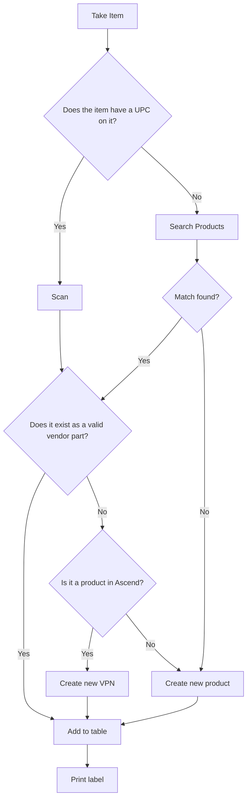

# Receiving Flow

## Receiving Workflow

### Overview

**High Level Goal:** Permit multiple users to simultaneously collect information for, tag, and check-in items for large receiving orders.

**Order Receipt Components**: An order receipt's central part is its *order items* — the product quantities we are receiving into inventory, identified by a Vendor Part Number (VPN). Items that do not yet have a Vendor Product (or a Product at all) in Ascend are no longer staged locally; scanning such an item creates the missing Ascend record(s) directly (see the flow below), and the resulting Vendor Product is linked onto the order item immediately.

### Implementation

**Frappe Workflows:** Before any custom coded controllers are handlers are made, the viability of Frappe Framework's built-in Workflows feature should be evaluated first. 

**Current Setup:** The Doctype Order Receipt, under the Ascend module, has fields for the Vendor, Purchase Order Number, and an Order Items table (child Doctype Order Receipt Item, which links to Vendor Product). Creating a wholly new product uses the standalone New Product Doctype as the entry UI for the Ascend Product + Vendor Product pair it will create. No workflow is in place; saving edits changes the database records immediately. 

## Vendor Product Scanning and Validation

The following is a high-level overview of how vendor product scanning and checking works. The primary goal of the flow is to avoid circumstances were we are re-entering information for a product that already exists in Ascend.

For example, if we receive a new Dalbello boot as part of a buyout, instead of manually entering the boots information (description, brand, style, color, size, etc.) to create the new Vendor Product, we lookup to see if we have received that same Dalbello boot under a different vendor, and reuse that product information.

### Mermaid Diagram



---

### Structured Text Description

**Start:** Take Item

1. **Decision — Does the item have a UPC on it?**
   - **Yes** → Go to step 2a (Scan)
   - **No** → Go to step 2b (Search Products)

2. **Path A — Item has UPC:**
   - **Scan** the item
   - Go to step 3 (valid vendor part check)

   **Path B — Item has no UPC:**
   - **Search Products** manually
   - **Decision — Match found?**
     - **Yes** → Go to step 3 (valid vendor part check)
     - **No** → Go to step 5 (Create new product)

3. **Decision — Does it exist as a valid vendor part?**
   - **Yes** → Go to step 6 (Add to table)
   - **No** → Go to step 4 (Ascend check)

4. **Decision — Is it a product in Ascend?**
   - **Yes** → **Create new VPN** → Go to step 6 (Add to table)
   - **No** → Go to step 5 (Create new product)

5. **Create new product** → Go to step 6 (Add to table)

6. **Add to table**

7. **End: Print label**

---

### Node Summary

| Node | Type | Description |
|------|------|-------------|
| Take Item | Start | Entry point; pick up a physical item to receive |
| Does the item have a UPC on it? | Decision | Check for barcode/UPC label on the item |
| Scan | Process | Scan the item's UPC barcode |
| Search Products | Process | Manually search for the product in the system |
| Match found? | Decision | Did the manual search return a matching product? |
| Does it exist as a valid vendor part? | Decision | Check if the scanned/matched item is a known vendor part |
| Is it a product in Ascend? | Decision | Check if the product exists in the Ascend RMS database |
| Create new VPN | Process | Create a new Vendor Part Number entry |
| Create new product | Process | Create a brand-new product record in Ascend |
| Add to table | Process | Add the item (via any path) to the receiving table |
| Print label | End | Print a label for the received item |

### scan_item() Static Method
```
bullwheel.ascend.doctype.order_receipt.order_receipt.scan_item
```

scan_item() is a whitelisted, static method that handles the Vendor Product and Product existance checks in Ascend. The method is currently called inside order_receipt.js when the user enters a barcode value into a designed scanning field. It takes two paramters: *id* and *vendor*. The id parameter is the value scanned by the user. It could be a UPC, Ascend SKU, VPN, etc. The vendor parameter is the exact name of the vendor as it appears in Ascend. 

**Return Values** scan_item() returns a tuple with two elements. The first is a status string, as detailed below. The second is an id corresponding with the record found.

|Status|ID String|
|------|---------|
|'vpn found'| A Vendor Product was found. Returns the VPN of the item. |
|'product found'| No Vendor Product was found, but a product was. Returns the Ascend SKU (a.k.a Store UPC) of the item. |
|'not found'| No matching Vendor Product or Product was found. Returns NoneType |