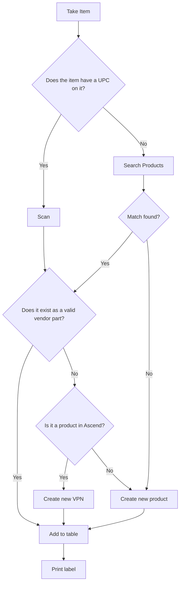

# Receiving Flow

## Mermaid Diagram

---

## Structured Text Description

**Start:** Take Item

1. **Decision — Does the item have a UPC on it?**
   - **Yes** → Go to step 2a (Scan)
   - **No** → Go to step 2b (Search Products)

2. **Path A — Item has UPC:**
   - **Scan** the item
   - Go to step 3 (valid vendor part check)

   **Path B — Item has no UPC:**
   - **Search Products** manually
   - **Decision — Match found?**
     - **Yes** → Go to step 3 (valid vendor part check)
     - **No** → Go to step 5 (Create new product)

3. **Decision — Does it exist as a valid vendor part?**
   - **Yes** → Go to step 6 (Add to table)
   - **No** → Go to step 4 (Ascend check)

4. **Decision — Is it a product in Ascend?**
   - **Yes** → **Create new VPN** → Go to step 6 (Add to table)
   - **No** → Go to step 5 (Create new product)

5. **Create new product** → Go to step 6 (Add to table)

6. **Add to table**

7. **End: Print label**

---

## Node Summary

| Node | Type | Description |
|------|------|-------------|
| Take Item | Start | Entry point; pick up a physical item to receive |
| Does the item have a UPC on it? | Decision | Check for barcode/UPC label on the item |
| Scan | Process | Scan the item's UPC barcode |
| Search Products | Process | Manually search for the product in the system |
| Match found? | Decision | Did the manual search return a matching product? |
| Does it exist as a valid vendor part? | Decision | Check if the scanned/matched item is a known vendor part |
| Is it a product in Ascend? | Decision | Check if the product exists in the Ascend RMS database |
| Create new VPN | Process | Create a new Vendor Part Number entry |
| Create new product | Process | Create a brand-new product record in Ascend |
| Add to table | Process | Add the item (via any path) to the receiving table |
| Print label | End | Print a label for the received item |
